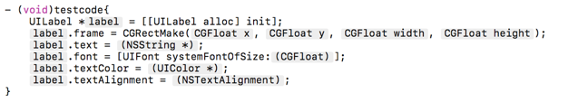

## HT Code Snippets
---

HT Code Snippets 提供了一些默认的Objective-C 的代码模版，目前有：

*  htbutton
*  htlabel
*  htimageview    
*  htalertcontroller
*  htscrollview
*  uiscrollviewdelegate
*  uitableview   
*  uitableviewdelegate
*  uitableviewdatasource
*  uicollectionview  
*  uicollectionviewDelegate
*  UICollectionViewDataSource
*  init
*  singleton
*  strongself
*  weakself

### 用法
---
在Xcode输入代码时会自动提示,选取对应的代码模版即可，下图为htlable的效果：

### 安装
---

下载本仓库，然后运行install.sh即可