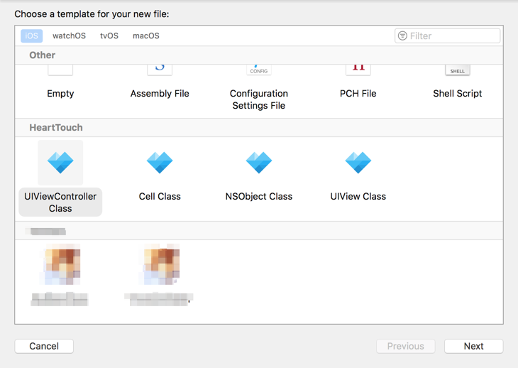
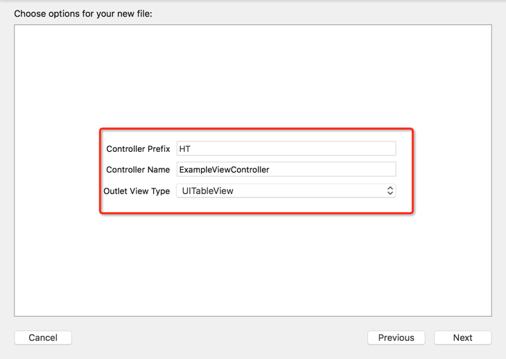

## HT File Templates
---

HT File Templates 提供了一些默认的Xcode文件模版，创建文件的时候可供选择，目前支持：

* UIViewController 模版（包含UITableView／UIView／UICollectionView（FlowLayout）类型）
* UIView 模版
* Cell 模版（包含UITableViewCell／UICollectionViewCell 类型）
* NSObject 模版

### 用法
---
在Xcode新建文件的时候选择模版如下图：

选中想要的文件模版之后，填充好对应的选项，即可。 如下图：

### 安装
---

下载本仓库，然后运行install.sh即可